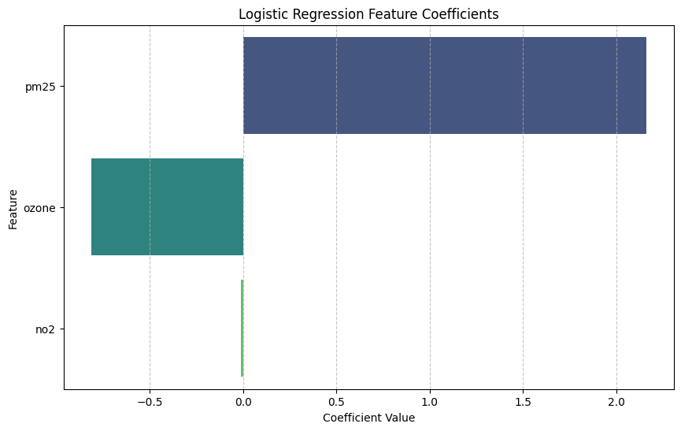

# Headline: Air Pollution Trends Reveal PM2.5 as Primary Driver of Unhealthy Air Days in Virginia
## Hook: Air quality is something most people only notice when it becomes a problem, but by then, it may already be affecting health.

## Problem Statement: With rising concerns around pollution and public health, understanding what actually drives poor air quality is critical. Air quality is influenced by multiple pollutants, including fine particulate matter (PM2.5), ozone, and nitrogen dioxide (NO₂). While all are known to impact health, it is not always clear which pollutants are most responsible for pushing air quality into unhealthy levels on a day-to-day basis. Without this understanding, it becomes difficult to prioritize monitoring efforts, inform the public effectively, or develop targeted environmental strategies. This project aims to identify which pollutants contribute most to unhealthy air quality, and use those pollutant levels to predict whether a given day will have subpar air quality levels in Virginia.

## Solution Description: To answer this question, I looked at two years of daily air readings collected from monitoring sites spread across Virginia. Every day, those stations record how much of each pollutant is in the air and assign an overall score reflecting whether conditions are safe or harmful to breathe.

## Using this data, I then built a prediction model to determine which pollutants are most responsible for driving poor air quality. By comparing daily pollutant levels to whether a day was ultimately flagged as unhealthy (AQI<50), the model identified which pollutant most consistently predicts when air quality turns bad, and which ones have little impact. The pattern held up nearly every single time, giving advocates and policymakers a reliable, evidence-based answer rather than a guess.

## This knowledge gives environmental advocates, policymakers, and communities the evidence they need to target the right sources of pollution and push for meaningful change.

## Chart: The results show that PM2.5 is the main cause of poor air quality and is the most important factor to pay attention to. When PM2.5 levels are high, it strongly increases the chance of a bad air day. Ozone plays a smaller role and is slightly associated with better air conditions when looked at alongside the other pollutants. NO₂ has very little impact overall and does not meaningfully affect whether an air day is good or bad.

